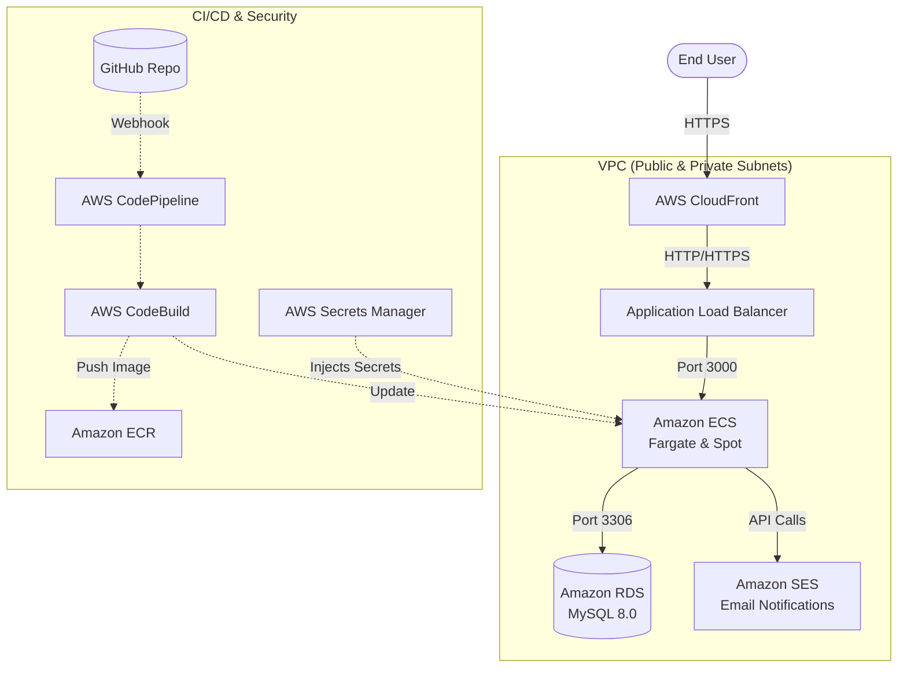

# BloodBank Management System

A full-stack blood bank management system built with Next.js, Prisma, and MySQL.

## Tech Stack

- **Frontend:** Next.js 16, React, TypeScript, Tailwind CSS, shadcn/ui, Framer Motion
- **Backend:** Next.js API Routes, Prisma ORM
- **Database:** MySQL
- **Authentication:** NextAuth.js v5 (Credentials provider)
- **Email:** AWS SES
- **Deployment:** Docker, Terraform (AWS)

## Features

### Public
- Blood availability search with real-time stock display
- Blood request submission
- Donor registration (Immediate signup)
- Recipient registration

### Admin Portal
- Dashboard with key statistics and blood stock chart
- Donor management (view, delete)
- Blood stock management (add, subtract, set quantities)
- Blood request approval/rejection (with stock deduction)
- Appointment management (approve, reject, mark complete)
- Recipient management

### Donor Portal
- Personal dashboard with eligibility and donation stats
- Appointment booking and history tracking
- Profile management (contact info, health details)

---

## 💻 Local Development Setup

### Prerequisites
- Node.js 20+
- MySQL database

### Setup Steps
1. Clone the repository and navigate to the Next.js directory:
   ```bash
   git clone https://github.com/<your-username>/Bloodbank-management-system.git
   cd Bloodbank-management-system/bloodbank-next
   ```
2. Copy the environment file and configure your database and secrets:
   ```bash
   cp .env.example .env
   ```
3. Install dependencies:
   ```bash
   npm install
   ```
4. Push the database schema and seed default data:
   ```bash
   npx prisma db push
   node prisma/seed.js
   ```
5. Start the development server:
   ```bash
   npm run dev
   ```

---

## ☁️ AWS Architecture & Deployment Guide

This project includes production-ready **Terraform Configuration** to deploy the entire stack to AWS in minutes. 

### AWS Architecture Overview



### CI/CD Practices (Continuous Integration & Deployment)
This repository leverages advanced DevOps methodologies to ensure seamless updates with zero downtime:
* **Fully Automated Pipeline**: Built using AWS CodePipeline. Pushing changes to the `main` GitHub branch automatically triggers a build.
* **Build Phase**: AWS CodeBuild creates a Docker container, compiles the Next.js app, and pushes the optimized image to Amazon ECR.
* **Zero-Downtime Rolling Updates**: AWS ECS gracefully rolls out new container instances and drains old ones only when the new instances pass ALB health checks.
* **Circuit Breaker Rollbacks**: If a bad deployment occurs (e.g., application crashes on start), ECS automatically halts the deployment and rolls back to the previous stable version.
* **Secure Secret Injection**: No passwords are kept in code or environment files on the server. AWS Secrets Manager injects credentials securely into the ECS task at runtime.

### Step-by-Step AWS Setup for forkers

If you have forked this repository and want to host it on your own AWS account, follow these steps strictly:

#### 1. Setup Deployment Variables
All passwords and sensitive tokens are managed via Terraform variables and injected into AWS Secrets Manager. 

Navigate to the terraform directory:
```bash
cd terraform
```
Copy the example variables file:
```bash
cp terraform.tfvars.example terraform.tfvars
```
**Open `terraform.tfvars` and fill it out completely.** 
* Set strong passwords for `db_password` (min 12 chars), `admin_password` (min 8 chars), and `nextauth_secret` (generate one using `openssl rand -base64 32`).
* Provide your GitHub repository string (e.g., `YourUsername/bloodbank-management-system`).

> ⚠️ **Note:** `terraform.tfvars` is intentionally included in `.gitignore` so your secrets are never accidentally pushed to GitHub.

#### 2. Deploy Infrastructure
Authenticate with your AWS CLI locally, then run:

```bash
terraform init
terraform plan
terraform apply
```
Type `yes` to confirm. Terraform will provision the VPC, RDS database, ECS cluster, ALB, Security Groups, and CI/CD pipelines.

#### 3. Connect GitHub to AWS CodePipeline
Because your AWS account needs permission to read your public GitHub repository during builds, Terraform creates a pending connection.

1. Log into your **AWS Console**.
2. Navigate to **Developer Tools** ➡️ **Settings** ➡️ **Connections**.
3. You will see a connection named `bloodbank-gms-github-connection` in a `Pending` state.
4. Click on it and choose **Update pending connection**.
5. Follow the prompts to authorize AWS to access your GitHub repositories.

#### 4. Trigger the First Deployment
Once the GitHub connection is active:
1. Navigate to **CodePipeline** in the AWS Console.
2. Select your pipeline (`bloodbank-gms-pipeline`).
3. Click **Release change** to manually start the first build process.
4. CodeBuild will create your Next.js Docker image, push it to ECR, and start the Fargate instances!

---

## Default Admin Credentials
- **Email:** admin@bloodbank.com
- **Password:** The password you defined as `admin_password` in `terraform.tfvars`

## License
This project is for educational purposes.
